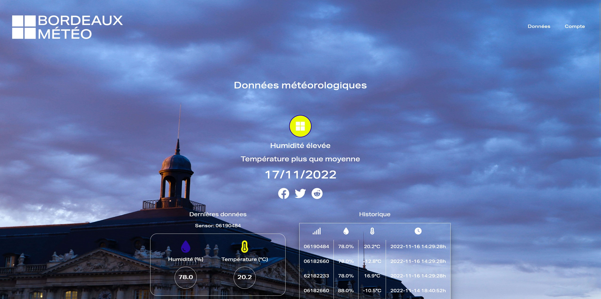

# Bordeaux Météo ☀️☁️

Dans le cadre de la formation de développeur informatique que je réalise actuellement au CESI de Bordeaux, j'ai réalisé une application permettant de consulter des données météorologiques relatives à la température et l'humidité captées par des sondes à Bordeaux, avec deux autres étudiants de ma promotion. Cette application fonctionne notamment grâce à une API.

## Langages

- **Front-end:** HTML, CSS, JavaScript, SASS (framework CSS Bootstrap, librairie d'icônes Fontawesome, librairies JavaScript Chart.js et Leaflet)
- **Back-end:** Python, SQL (framework Python Flask)

## Outils

- **Gestion de projet**: Jira
- **Maquettage**: Adobe XD
- **IDE:** Visual Studio code
- **Modélisation de base de données**: JMerise
- **Serveur local:** WampServer (utilisation de MySQL et phpMyAdmin)
- **Gestion de version**: Git

</a>&nbsp;&nbsp;&nbsp;&nbsp;&nbsp;&nbsp;&nbsp;&nbsp;<a href="https://www.w3schools.com/css/" target="_blank" rel="noreferrer">&nbsp;&nbsp;&nbsp;&nbsp;&nbsp;&nbsp;&nbsp;&nbsp;&nbsp;&nbsp;</a>&nbsp;&nbsp;

## Collaboration

Compte Github d'**Alexandre Robert**:
- [Alexandre Robert](https://github.com/beezy97)  

Compte Github de **Matthis Le Mouilloir**:
- [Matthis Le Mouilloir](https://github.com/Matthis-LM)  

## Screenshot

 

 
